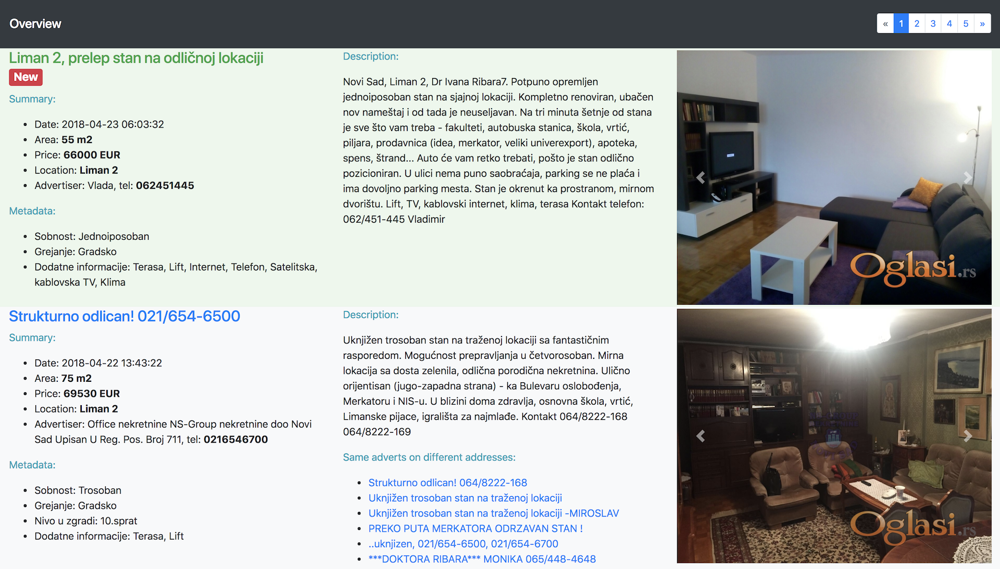
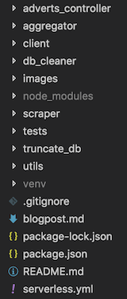

# Hello ~~world~~ **real estate advertisements**

A simple application written in Python using the [*serverless*](https://serverless.com/) framework to implement a real world scenario.

## Background story

I am looking for flat to buy. Since there are lots of recurring adverts on different ad websites, and the same flats are advertised multiple times to be always on the first page of results, I thought it would be an interesting idea to write an application which scrapes the advertisements from different sites and compares them. The main goal is to make a unique list of advertisements which is browseable.

In the past couple of months I am working with serverless technologies and I came up with the idea to implement this application as a serverless application, document it and share it.

The application is simple enough to understand, yet not a typical hello word application.

## Concept of serverless

In a nutshell, serverless means that you do not have to think about the servers. Just write the code which executes the business logic. The provider takes care of the rest (spinning up a container, initialization of the execution environment, code execution, scaling, etc.)

This enables fast project setup and efficient development.

## Application architecture

The architecture of the application is on the picture below.


The architecture consists of the following functions:

- `scraper` - scrapes the advertisements from three different sites for advertising. It extracts the data from the ads, formats the data and puts the data into `ScrapedAdverts` DynamoDB table. This is a scheduled lambda which is executed 3 time per day.
- `aggregator` - reads the data from `ScrapedAdverts` table and processes them. Checks if the given advertisement exists in `FilteredAdverts` table by performing a similarity check. If the advertisement exists, it is going to be updated. If it does not exists, the data is going to be inserted. This lambda is also scheduled and runs several times per day. It processes only a chunk of data from `ScrapedAdverts` (the amount of data which is returned in one scan by DynamoDB)
- `adverts_controller` - acts as request handler for the API Gateway. It is mapped to `GET adverts/get?page=` call.
- `db_cleaner` - is executed once per day and cleans the `ScrapedAdverts` table. It deletes the entires which are older than 15 days.

The frontend looks like this:



The frontend is hosted in a public S3 bucket and can be reached [here](http://adverts-website-bucket.s3-website.eu-central-1.amazonaws.com/).
It is a simple static website which fetches and visualizes the data got from `adverts_controller`. The data is a list of scraped and filtered adverts in JSON format:

```json
{
   "items":[
      {
         "metadata":[
            "Key1=Value1",
            "Key2=Value2"
         ],
         "location":[
            "Location name 1",
            "Location name 2"
         ],
         "area":55,
         "processed":true,
         "timestamp":1524463412,
         "images":[
            "https://url.to/image.jpg",
         ],
         "text":"Longer description of the property",
         "link":"https://link.to/propery",
         "advertiser":{
            "name":"Advertiser name",
            "phones":[
               "066 1234567",
               "021 1234567"
            ]
         },
         "price":66000,
         "title_hash":"11344e17595d494506e87fa61925018b34443016",
         "title":"Title of advert"
      },
      ...
   ],
   "page":0,
   "number_of_pages":5,
   "count":124,
   "page_count":25
}
```

## Project structure

The project has the following structure:



The main entry point is the `serverless.yml` file which configures the serverless framework for this application. Beside that every function is in its own directory, and every function has its own requirements (`requirements.txt`).

The exceptions are the following directories:

- `tests` - contains the unit tests.
- `utils` - contains common helper functions. The content of this directory in included in every packed function.
- `client/dist` - contains the frontend code (HTML and JS).

### The `serverless.yml`

The main entry point of the project is the `serverless.yml` file. This file tells the serverless framework what do deploy and how.

It consists of the following main parts:

- `provider`: configures the cloud provider, which is AWS in our case. It defines the runtime, region and other common values which are applied to every function.
- `package`: configures the way of packing the functions.
- `functions`: defines the lambda functions. Under every function is the configuration for the given function. `handler` specifies the method which is called when the function is invoked. The global configuration values can be overridden in the functions. `event` defines what invokes the function.
- `resources`: defines the resources which should be created when the application is deployed. The resources part must use [CloudFormation](https://docs.aws.amazon.com/AWSCloudFormation/latest/UserGuide/template-reference.html) syntax.
- `plugins`: defines the plugins which are used by serverless framework.
- `custom`: defines the configuration values for the plugins.

The projects `serverless.yml` can be found [here](https://gitlab.codecentric.de/jozef.jung/sls-basics/blob/master/serverless.yml)

Below is an example which defines a function, configures a http event for the given function and creates a DynamoDB table:

```yaml
service: my-sls-service

provider:
  name: aws
  runtime: python3.6
  iamRoleStatements:
    - Effect: "Allow"
      Action:
        - "dynamoDB:*"
      Resource: "*"

package:
  individually: true

functions:
  my_controller:
    handler: lambda_handler.handle
    module: my_controller
    environment:
      USERS_TABLE: Users
    events:
      - http:
          path: users/get/all
          method: get

resources:
  Resources:
    usersTable:
      Type: AWS::DynamoDB::Table
      Properties:
        TableName: Users
        AttributeDefinitions:
          - AttributeName: email
            AttributeType: S
        KeySchema:
          - AttributeName: email
            KeyType: HASH
        ProvisionedThroughput:
          ReadCapacityUnits: 5
          WriteCapacityUnits: 5

plugins:
  - serverless-python-requirements
```

### The lambda handler

On AWS lambda, when using Python, the function which are used for handling the invocation should have the following signature:

```python
def handler(event, context):
    return
```

- `event` holds the data which is passed to function, e.g.: if the handler handles http events, the the request body, the query parameters, path parameters, etc. are passed in the event object.
- `context` is injected by the AWS lambda runtime, and it can be used to gather information and interact with the runtime. More info on this can be found [here](https://docs.aws.amazon.com/lambda/latest/dg/python-context-object.html).

[Boto3](http://boto3.readthedocs.io/en/latest/) library is the de-facto standard in Python to interact with the AWS services. It is available in the AWS Python runtime.

The code which would satisfy the above given example would look like this:

```python
import boto3
from os import environ as env


def handle(event, context):
    users_table = boto3.resource('dynamodb').Table(env['USERS_TABLE'])
    return users_table.scan()['Items']
```

### Testing

So far, so good, it's simple and easy to write functions. But what about the testing? Testing a lambda function by deploying it and invoking, and then watching the logs is a bad idea.

Writing unit tests is a crucial step in writing better code. Fortunately the lambda functions are easily testable. [Moto](http://docs.getmoto.org/en/latest/) is a powerful library for testing lambda function. It mocks AWS services like DynamoDB and the mocked service behaves like the real service.

## Notes

Please check out the project's [readme file](https://gitlab.codecentric.de/jozef.jung/sls-basics/blob/master/README.md). It contains the steps how to set up the application, how to run the tests anf how to deploy it.

## Conclusion

We've seen that implementing a simple application is easy with the help of serverless framework and AWS stack.

There are several things which can be added/improved:

- security: deny all permissions and allow some on function level
- ability to manage ads: add an authenticated user which can manage the scraped adverts
- make the scraper configurable